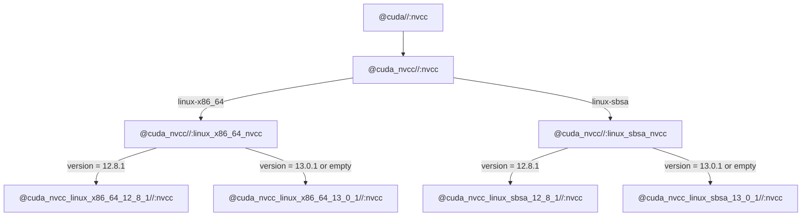
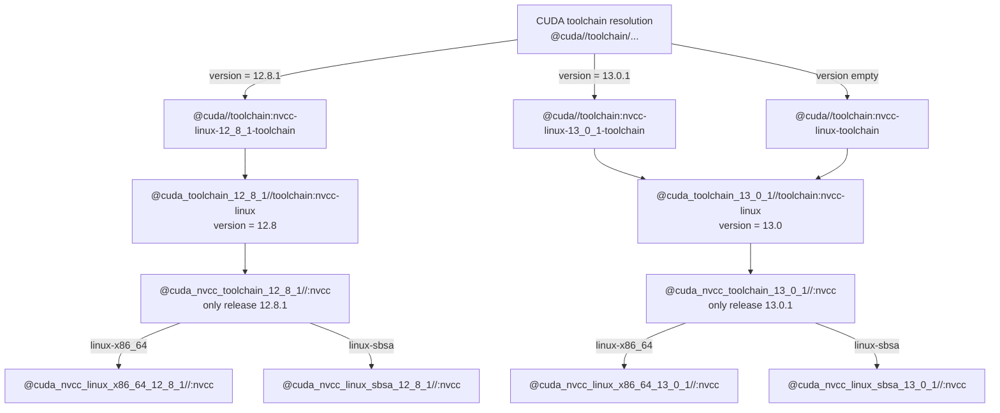

# CUDA repository hierarchy

With Bzlmod, `cuda.redist_json` declares available toolkit releases and platforms,
and `cuda.toolkit(name = "cuda")` creates the public `@cuda` repository. The
extension also creates a toolchain implementation repository for each release.
`--@rules_cuda//cuda:version` selects both the implementation and the public
component aliases. An empty version selects the highest declared release; an
undeclared version fails toolchain resolution when CUDA is enabled.

The diagrams below use CUDA 12.8.1 and 13.0.1, each declared for `linux-x86_64` and
`linux-sbsa`. Names are the extension's generated repository names; Bazel's
canonical names also contain a module-extension prefix. Consumers normally only
need `use_repo(cuda, "cuda")` and public `@cuda` labels.

## Public component aliases

The public aliases select a platform and then a release. This extends the
[original version and architecture resolution diagram](https://github.com/bazel-contrib/rules_cuda/issues/477#issuecomment-4582635396).

For `nvcc` and `nvvm`, platform selection follows the execution configuration,
with `--@rules_cuda//cuda:exec_platform` available as an override. Libraries and
headers follow the target platform. The `cuda:aarch64` flag distinguishes
`linux-sbsa` from `linux-aarch64`, which share the same CPU and OS constraints.
The diagrams omit intermediate auto-detection aliases and unavailable-platform
branches. Missing component/platform combinations can resolve to dummy targets;
an unsupported platform configuration has a diagnostic target.

## Versioned toolchain implementations

Toolchain resolution selects a whole implementation with fixed version metadata.
Its component mappings contain only that release. When a component has multiple
platforms, a release-specific alias repository preserves platform selection.

The diagram shows the Linux nvcc declarations. Windows nvcc and Clang have
corresponding declarations, gated by the compiler setting and, for nvcc, platform
constraints. The implementation's `nvcc-linux` label aliases the implementation
in its `toolchain/nvcc` package. Both paths above share the same downloaded
component repositories; versioned toolchain repositories do not download another
copy of the toolkit.

| Repository                       | Responsibility                                                             |
| -------------------------------- | -------------------------------------------------------------------------- |
| `@cuda`                          | Public component aliases and version-gated toolchain declarations.         |
| `@cuda_toolchain_12_8_1`         | Toolchain implementations and component mappings for one release.          |
| `@cuda_nvcc`                     | Public nvcc aliases across declared platforms and releases.                |
| `@cuda_nvcc_toolchain_12_8_1`    | Platform selection for nvcc within one release.                            |
| `@cuda_nvcc_linux_x86_64_12_8_1` | Downloaded component files and BUILD targets for one platform and release. |

If a component has only one platform for a release, the implementation points
directly to its concrete component repository. For a single declared release and
platform, the public component aliases also bypass the intermediate alias
repository. A redistribution-based toolkit still has a versioned implementation
and public facade when only one release is declared.

## BUILD-time version checks

Repository generation and BUILD-file loading happen before configurable
attributes are resolved. Consequently, `if_cuda_toolkit_version_ge` needs the
version of the repository whose BUILD file is being evaluated. It cannot obtain
the selected release from a build-setting `select()`.

Each redistribution component gets a local `defs.bzl`, stamped with the
**containing toolkit release**, which can differ from the component's own version.
For example, the CUDA 12.8.1 CCCL repository evaluates its header paths using
`(12, 8)` even when CUDA 13.0.1 is also declared. Versioned implementation
repositories likewise generate their own helpers. Component and local-toolkit
BUILD files load `//:defs.bzl`; manually declared components without version
metadata inherit their toolkit's helpers.

The public facade exposes the union of available component targets through
aliases, without generating or loading a `defs.bzl` of its own. Putting a single
version-stamped helper there and loading it inside every component would
incorrectly apply one release's layout to the other archives.

Local toolkit discovery and manually assembled toolkits continue to generate
their implementations directly in the toolkit repository. The per-release
implementation hierarchy described here is created by the Bzlmod redistribution
extension.
